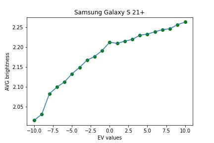
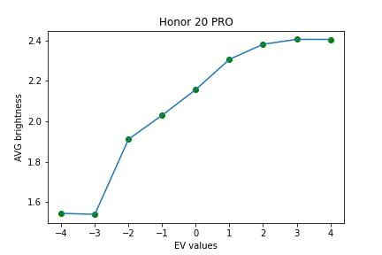
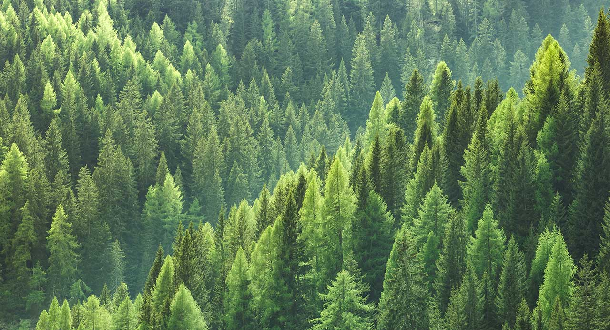
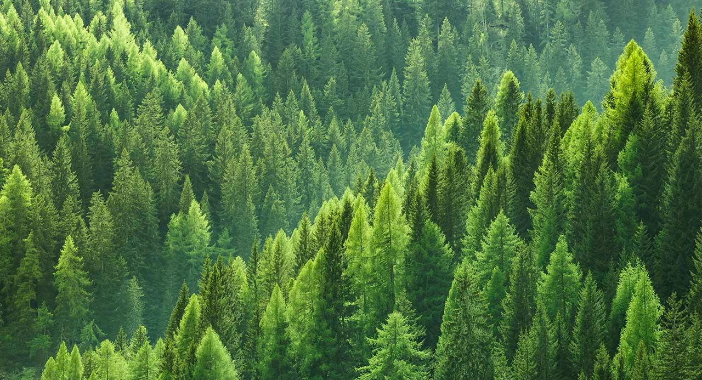

## Программные средства решения математических задач.

### Лабораторная №1 - исследование динамического диапазона.

---

Для вычисления динамического диапазона фотокамеры необходимо сделать
фотографии с разным параметром Exposure Value.

Экспозиционное число (англ. Exposure Value, EV) — 
условное целое число, однозначно характеризующее экспозицию при фото- и 
киносъёмке.

Шкала экспозиционных чисел основана на логарифмической зависимости с основанием 2:

где N соответствует диафрагменному числу, а t — времени экспозиции в секундах.

Для вычисления динамического диапазона была сделана 21 фотография на телефон
Samsung Galaxy S21+. Фотографии находятся в папке [samsung](FirstLab/samsung).
Значение Ev варьируется от -10 до 10.

Для сравнения были сделаны 9 фотографий на телефон Honor 20 PRO (данная модель поддерживает 
изменение параметра Ev от -4 до 4), которые находятся в папке [honor](FirstLab/honor).

Каждая фотография была переведена в градации серого, с использованием библиотеки
cv2, и обрезана по заданному диапазону (64х64 пикселя в середине фотографии).
Для каждого обрезанного участка было подсчитано среднее арифметическое значение яркости.

На основании вычисленных значений были построены графики:

**Вывод**:
Исходя из данных, представленных на графиках, можно видеть, что разброс
значений динамического диапазона у телефона модели "Honor 20 PRO" больше,
чем у телефона модели "Samsung Galaxy S21+". Отсюда можно сделать вывод,
что камера телефона марки Samsung лучше.

---

### Лабораторная №2 - насыщенность фотографии с использованием LAB.

---

С использованием LAB можно менять насыщенность фотографии, изменяя компоненты
цвета. 

В системе LAB каждый цвет представим 3-мя координатами - ``L, A, B``. 
Первая координата отвечает за альфа канал фотографии. Чем больше ее значение, 
тем светлее изображение. Соответственно, для осветления 
изображения нам необходимо выделить канал L и увеличить его показатель.

Вторая координата обозначает положение цвета в диапазоне от зеленого до пурпурного, третья — от синего до желтого.
Домножив их на некий коэффициент, можно усилить или ослабить тот, или иной цвет.

Пример:

Исходное изображение:

Обработанное изображение(A * 0.95, B * 1.05, L - 10):

Исходное изображение:

Обработанное изображение(A * 0.95, B * 1.05, L - 10):
